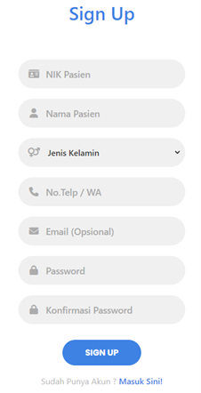

[![Contributors][contributors-shield]][contributors-url]
[![LinkedIn][linkedin-shield]][linkedin-url]

<!-- PROJECT LOGO -->
 

  

  <h3 align="center">Homecare Alsyifa</h3>

  

    Pemesanan dan Pengelolaan Layanan Homecare PT Alsyifa Medika Lestari
     
  

<!-- TABLE OF CONTENTS -->
<!-- 

  
Table of Contents

  <ol>
    <li>
      <a href="#about-the-project">About The Project</a>
      <ul>
        <li><a href="#built-with">Built With</a></li>
      </ul>
    </li>
    <li><a href="#contributing">Contributing</a></li>
    <li><a href="#contact">Contact</a></li>
  </ol>

 -->

<!-- ABOUT THE PROJECT -->
## About The Project

Website yang dikembangkan untuk PT Alsyifa Medika Lestari berfungsi sebagai platform pemesanan layanan Homecare dan pengelolaan data operasional klinik. Sistem ini bertujuan untuk mempermudah pasien dalam mendapatkan layanan kesehatan di rumah serta meningkatkan efisiensi manajemen layanan oleh pihak klinik. 

**Key Features:**

- Pemesanan Layanan Homecare
- Manajemen Data Pasien dan Dokter
- Authentication dan Authorization
- Integrasi dengan Google Maps API
- Dashboard dan Laporan

**Screenshots App:**

    
## Pasien
  
| Register Screen | Home Screen | Tambah Alamat Screen |
|:--------------:|:------------:|:---------------:|
|  |  |  |

| Detail Alamat Screen | Detail Layanan Screen | Pemesanan Screen |
|:-----------:|:----------------:|:-------------:|
|  |  |  |

## Admin
  
| Daftar Pesanan Screen | Detail Pesanan Screen |
|:--------------:|:------------:|
|  |  |

| Daftar Layanan Screen | Detail Layanan Screen |
|:--------------:|:------------:|
|  |  |

| Daftar Pasien Screen | Daftar Staf Medis Screen |
|:-----------:|:----------------:|
|  |  |

### Built With

**Framework and Language:**
* [![Laravel][Laravel]][Laravel-url]
* [![Javascript][Javascript]][Javascript-url]

**Library and Technology:**
* [![MySQL][MySQL]][MySQL-url]
* [![Google-Maps-API][Google-Maps-API]][Google-Maps-API-url]

<!-- CONRTIBUTORS -->
### Contributors:

<!-- 
(<a href="#readme-top">back to top</a>)
 -->

<!-- CONTACT -->
## Contact

Ja'far - ajib.aiwa@gmail.com
 
Fathimah Azzahra - fathimahazzahra@mhs.mdp.ac.id

<!-- MARKDOWN LINKS & IMAGES -->
<!-- https://www.markdownguide.org/basic-syntax/#reference-style-links -->
[contributors-shield]: https://img.shields.io/github/contributors/jafar144/kp-syifa.svg?style=for-the-badge
[contributors-url]: https://github.com/jafar144/kp-syifa/graphs/contributors
[linkedin-shield]: https://img.shields.io/badge/-LinkedIn-black.svg?style=for-the-badge&logo=linkedin&colorB=555
[linkedin-url]: https://www.linkedin.com/in/jafarrmu/

[Laravel]: https://img.shields.io/badge/Laravel-FF2D20?style=for-the-badge&logo=laravel&logoColor=FFFFFF
[Laravel-url]: https://laravel.com/
[Javascript]: https://img.shields.io/badge/Javascript-F7DF1E?style=for-the-badge&logo=javascript&logoColor=FFFFFF
[Javascript-url]: https://ecma-international.org/publications-and-standards/standards/ecma-262/

[MySQL]: https://img.shields.io/badge/MySQL-4479A1?style=for-the-badge&logo=mysql&logoColor=FFFFFF
[MySQL-url]: https://www.mysql.com/
[Google-Maps-API]: https://img.shields.io/badge/Google--Maps--API-4285F4?style=for-the-badge&logo=googlemaps&logoColor=FFFFFF
[Google-Maps-API-url]: https://developers.google.com/maps
